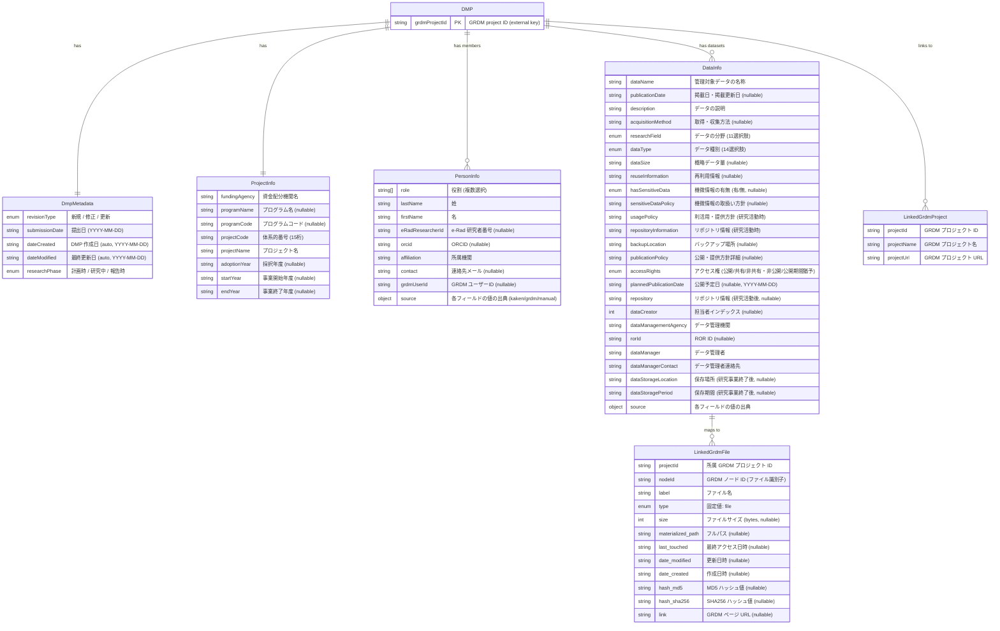

# Data Model

DMP データは GRDM プロジェクト内の `dmp-project.json` として保存されます。以下は `src/dmp.ts` の Zod スキーマに基づくデータモデルです。

## ER 図



## JSON 構造

```json
{
  "metadata": {
    "revisionType": "新規",
    "submissionDate": "2025-04-01",
    "dateCreated": "2025-04-01",
    "dateModified": "2025-04-01",
    "researchPhase": "計画時"
  },
  "projectInfo": {
    "fundingAgency": "日本学術振興会",
    "programName": "科学研究費助成事業",
    "programCode": "JP",
    "projectCode": "230000000000000",
    "projectName": "〇〇に関する研究",
    "adoptionYear": "2023",
    "startYear": "2023",
    "endYear": "2025"
  },
  "personInfo": [
    {
      "role": ["研究代表者"],
      "lastName": "山田",
      "firstName": "太郎",
      "affiliation": "〇〇大学",
      "eRadResearcherId": "12345678",
      "orcid": "0000-0000-0000-0000",
      "contact": "taro@example.ac.jp",
      "grdmUserId": "abc123",
      "source": { "lastName": "kaken", "firstName": "kaken" }
    }
  ],
  "dataInfo": [
    {
      "dataName": "実験データセット A",
      "description": "〇〇実験で取得したデータ",
      "researchField": "ライフサイエンス",
      "dataType": "実験データ",
      "usagePolicy": "プロジェクトメンバーのみ",
      "repositoryInformation": "GRDM プロジェクト内",
      "accessRights": "公開",
      "dataManagementAgency": "〇〇大学",
      "rorId": "https://ror.org/xxxxxxxx",
      "dataManager": "研究推進部",
      "dataManagerContact": "rdm@example.ac.jp",
      "linkedGrdmFiles": [
        {
          "projectId": "xxxxx",
          "nodeId": "abc123",
          "label": "experiment_a.csv",
          "type": "file",
          "materialized_path": "/data/experiment_a.csv",
          "hash_md5": "d41d8cd98f00b204e9800998ecf8427e",
          "size": 4096
        }
      ]
    }
  ],
  "linkedGrdmProjects": [
    {
      "projectId": "xxxxx",
      "projectName": "DMP-〇〇に関する研究",
      "projectUrl": "https://rdm.nii.ac.jp/xxxxx"
    }
  ]
}
```

## 値の出典（source フィールド）

`personInfo` および `dataInfo` の各フィールドには `source` オブジェクトが付随し、値がどこから取得されたかを記録します。

| 値 | 意味 |
|----|------|
| `"kaken"` | KAKEN API から自動取得 |
| `"grdm"` | GRDM ユーザー検索から取得 |
| `undefined` | ユーザーが手動入力 |

## 後方互換性

旧バージョンの `dmp-project.json` は `linkedGrdmProjectIds`（文字列配列）を使用していました。`readDmpFile()` がファイル読み込み時に自動的に `linkedGrdmProjects`（オブジェクト配列）へマイグレーションします。
