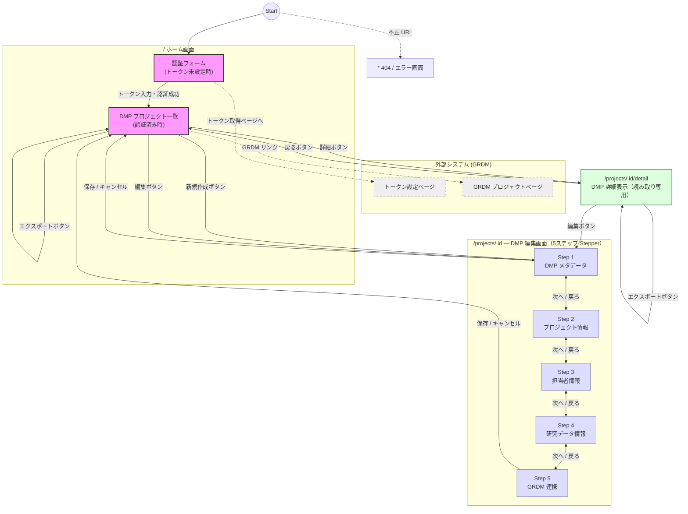

# Page Transition

## 画面遷移図

## ルート定義

| パス | コンポーネント | 説明 |
|------|--------------|------|
| `/` | `Home.tsx` | 認証フォームまたはプロジェクト一覧 |
| `/projects/new` | `EditProject.tsx` (`isNew=true`) | 新規 DMP 作成（5ステップ） |
| `/projects/:projectId` | `EditProject.tsx` | 既存 DMP 編集（5ステップ） |
| `/projects/:projectId/detail` | `DetailProject.tsx` | DMP 詳細表示（読み取り専用） |
| `*` | `StatusPage.tsx` | 404 / エラー表示 |

## 各画面の主な操作

### ホーム画面 (`/`)

- トークン未設定時は認証フォームを表示
- 認証成功後は `DMP-` プレフィックスの GRDM プロジェクト一覧を表示
- 各行で「編集」「詳細」「エクスポート（JSPS 様式）」「GRDM リンク」を提供

### DMP 編集画面 (`/projects/:id`)

- 5ステップの Stepper で構成
- ステップバークリックまたは「次へ」「戻る」ボタンで移動
- 必須項目が未入力の場合は次ステップへ進めない
- 未保存の変更がある状態でページ離脱を試みると確認ダイアログを表示
- 「保存」で GRDM の `dmp-project.json` に書き込み

### DMP 詳細表示画面 (`/projects/:id/detail`)

- 全フィールドを読み取り専用で表示
- 「編集」ボタンで編集画面へ遷移
- 「エクスポート」ボタンで JSPS 様式 Excel をダウンロード
