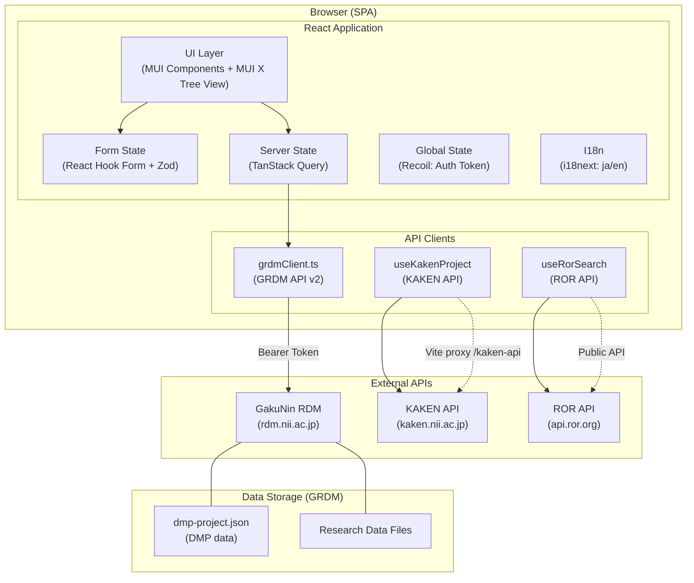
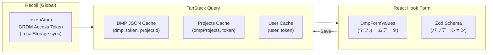
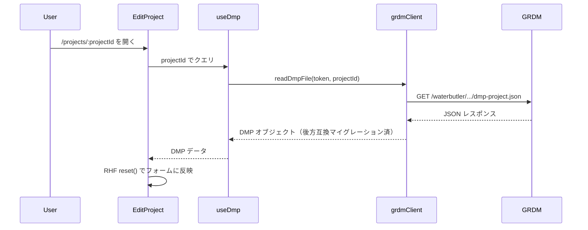
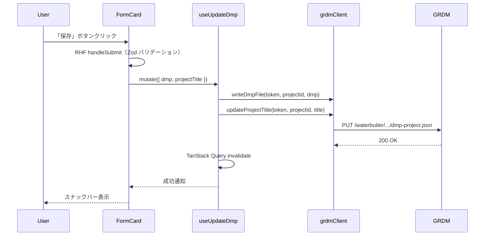
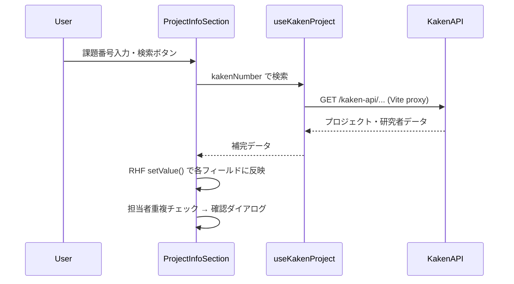
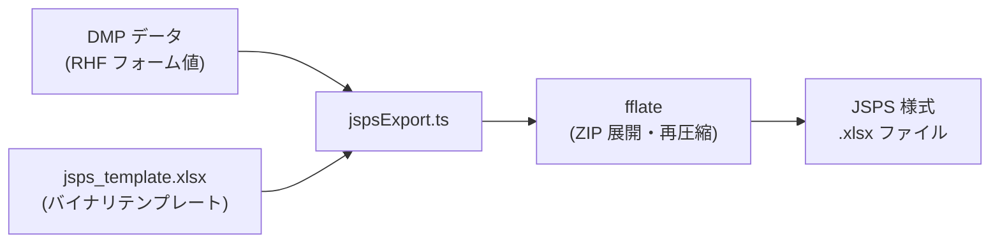
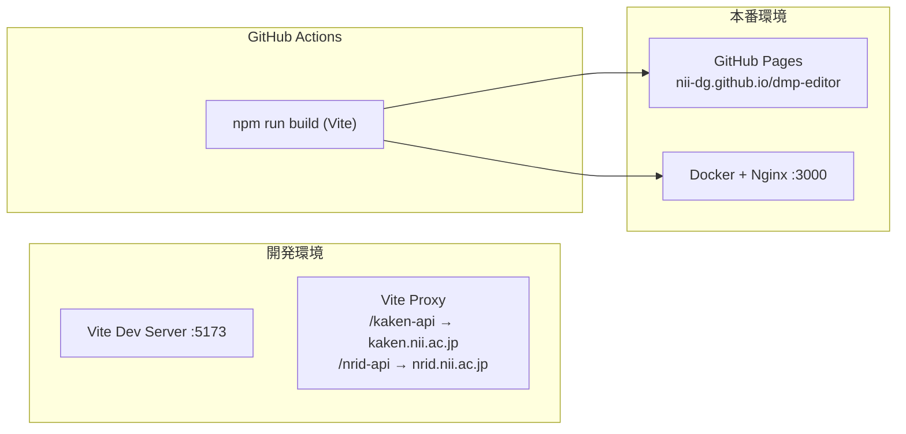

# System Architecture

DMP Editor はバックエンドサーバーを持たないフロントエンド専用 SPA です。データの永続化はすべて GakuNin RDM (GRDM) に委ねます。

## 全体構成

## レイヤー構成

### UI Layer（ページ・コンポーネント）

| ファイル | 役割 |
|---------|------|
| `pages/Home.tsx` | プロジェクト一覧・認証 |
| `pages/EditProject.tsx` | DMP 作成・編集（5ステップ Stepper） |
| `pages/DetailProject.tsx` | DMP 詳細表示・JSPS エクスポート |
| `pages/StatusPage.tsx` | エラー・404 表示 |
| `components/EditProject/FormCard.tsx` | Stepper 制御・保存処理 |
| `components/EditProject/*Section.tsx` | 各ステップのフォームセクション |

### 状態管理

### API クライアント

#### GakuNin RDM (`grdmClient.ts`)

- **認証**: Bearer Token（GRDM パーソナルアクセストークン）
- **リトライ**: 最大 5 回・10 秒タイムアウト・HTTP 429 対応
- **並行制限**: DMP ファイル存在確認は最大 4 並行（レート制限対策）
- **主要操作**: プロジェクト CRUD、ファイル読み書き、ユーザー検索、`dmp-project.json` の読み書き

#### KAKEN API (`useKakenProject.ts`)

- **用途**: 科研費課題番号からプロジェクト情報・研究者情報を自動取得
- **CORS 対策**: Vite プロキシ経由（`/kaken-api`, `/nrid-api`）

#### ROR API (`useRorSearch.ts`)

- **用途**: データ管理機関の ROR ID 検索
- **デバウンス**: 300ms・最小クエリ長 2 文字
- **言語**: 日本語クエリ（`[\u3040-\u30FF\u4E00-\u9FFF]`）で `lang: "ja"` 自動適用

## データフロー

### DMP 読み込み

### DMP 保存

### KAKEN 自動補完

## エクスポート処理

- ZIP として展開 → `xl/worksheets/sheet1.xml` を直接編集
- インラインストリング方式（shared-strings テーブル不使用）
- 担当者・データ項目行の自動拡張（行追加・セル参照シフト・merge セル更新）

## デプロイ構成

## セキュリティ

| 項目 | 対応 |
|------|------|
| 認証トークン | ブラウザのローカルストレージにのみ保存。サーバーへの転送なし |
| CORS | KAKEN/NRID API は Vite プロキシ経由。ROR は公開 API |
| XSS | JSPS エクスポート時に XML 特殊文字をエスケープ（`escXml()`） |
| 入力検証 | Zod スキーマによるフォームバリデーション（`onBlur` モード） |
